# TDengineGUI

> TDengineGUI是一个基于electron构建的，针对时序数据库[TDengine](https://github.com/taosdata/TDengine)的图形化管理工具。具有跨平台、易于使用、版本适应性强等特点。

[English](https://github.com/kangaroo1122/TDengineGUI/blob/main/README.md)
## 当前版本功能
- 通过TDengine restful接口连接到数据库，使用基本不受服务器版本升级影响。
- 数据库添加删除操作，显示数据库属性。
- 显示数据库中超级表和表信息，删除超级表与表功能。
- 显示超级表和表数据功能，提供分页、时间段检索、字段过滤、排序等功能。

## 如何获取

### 下载最新版可执行文件：
[release](https://github.com/kangaroo1122/TDengineGUI/releases/tag/1.0.3).

## 通过源代码运行开发版本：

- 克隆项目: git clone https://github.com/kangaroo1122/TDengineGUI.git
- 安装依赖: npm install
- 启动开发版本: npm run start
- 生成桌面应用（可选）: npm run build （生成在dist文件夹下）

## 使用说明

- 打开软件后，界面左侧会显示需要管理的数据库服务器列表和服务器中数据库列表，同时显示数据库服务器的版本号。

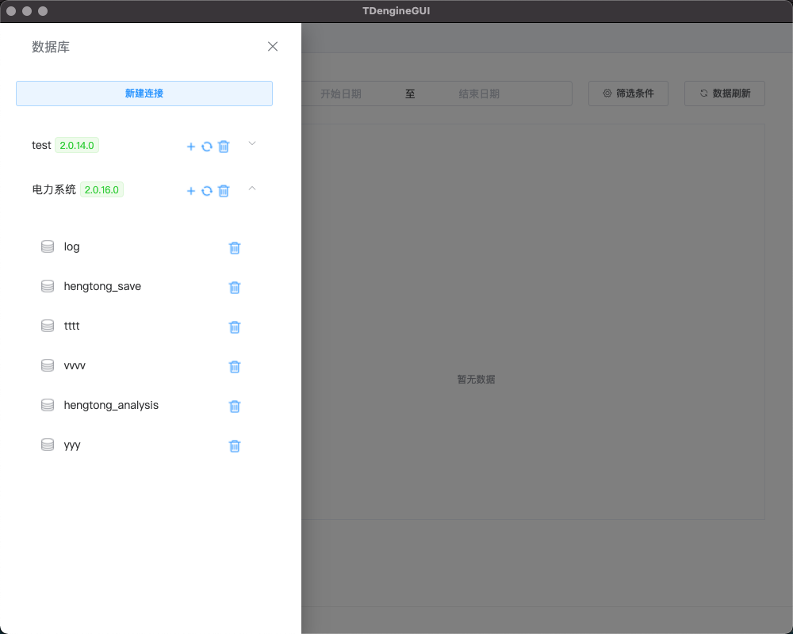

- 可以通过“新建连接”按钮，添加新的服务器进行管理。需要提供数据库服务器的ip地址、restful服务的端口号（默认为6041）、连接服务器的用户名和密码（默认为root:taosdata）

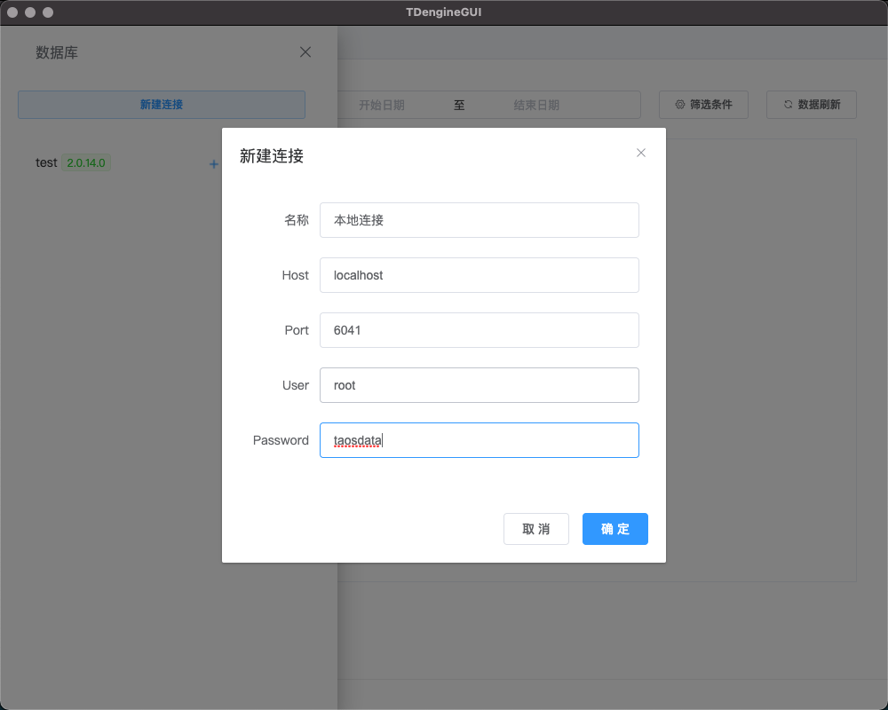

- 可以通过点击数据库后的删除图标，进行删除数据库操作。

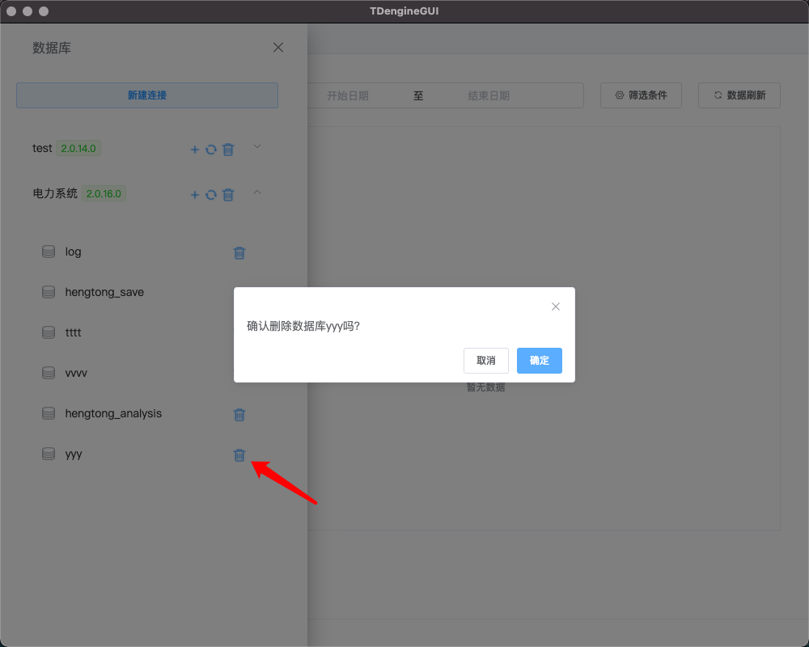

- 可以通过点击添加数据库图标，进行添加数据库操作。可以在添加时选择数据库属性(具体属性含义请参考[tdengine官方文档](https://www.taosdata.com/cn/documentation/taos-sql#management))

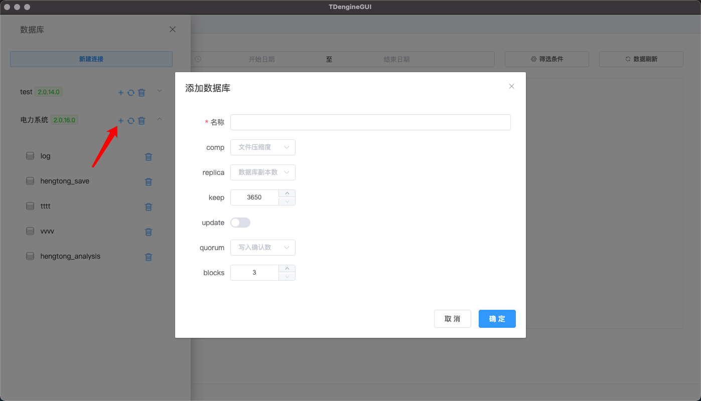

- 可以通过点击服务器连接后的删除图标，进行删除数据库连接操作。

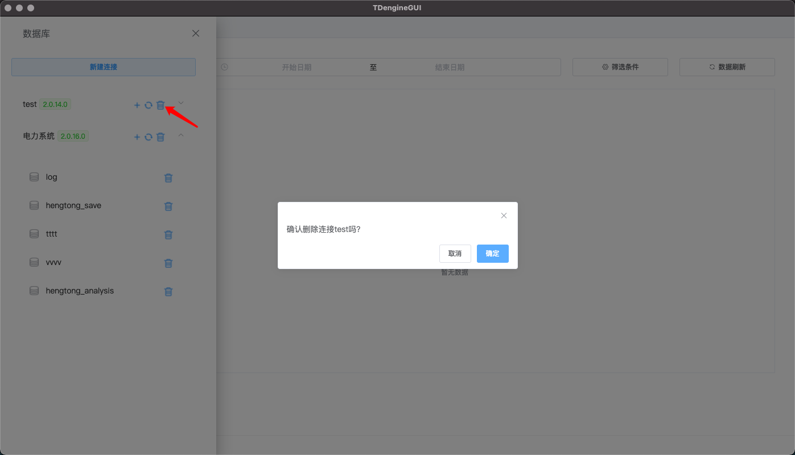

- 选择要操作的数据库后，即可进入当前数据库操作界面。可以通过点击“切换”按钮调出数据库导航栏，切换要操作的数据库。当前数据库操作界面中分 超级表、表、控制台、数据库属性四个标签页。每个标签页都针对当前数据库进行显示与操作。

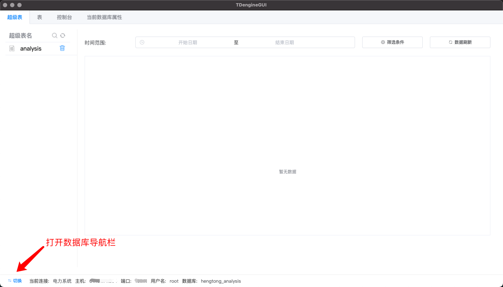

- 超级表（表）标签页中，左侧为超级表（表）的列表，可以进行删除与检索操作（添加、修改等操作后续版本将提供，当前版本如需增加数据表或者插入数据请使用控制台输入命令完成）。左侧则显示当前数据表的数据。

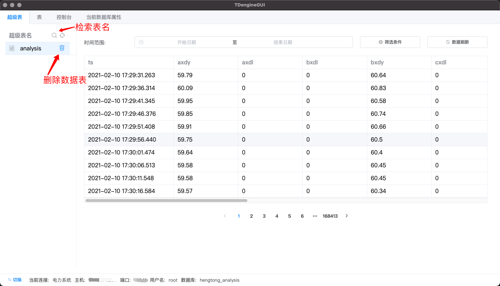

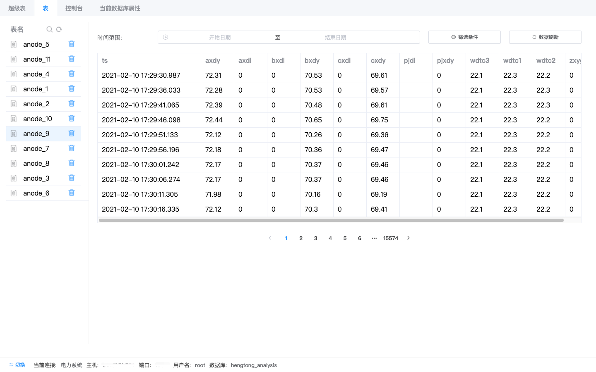

- 可以对表数据进行时间段选择。

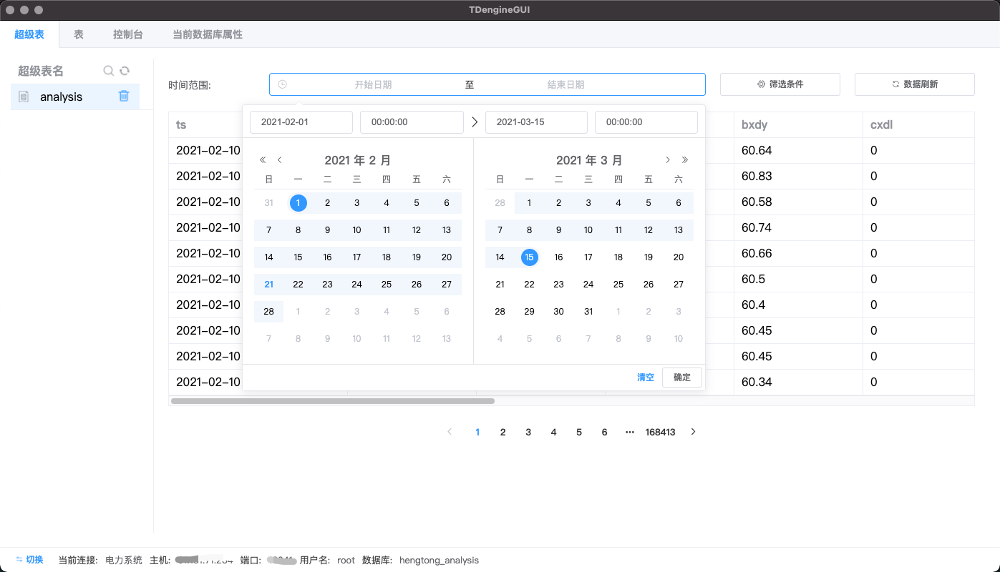

- 可以对表数据进行时间字段过滤、排序、分页等操作。

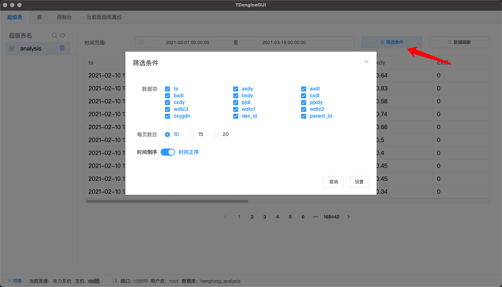

- 控制台中可以输入sql命令运行，并显示restful接口原始返回结果。控制台中输入的命令默认针对当前数据库进行操作，一般情况下不需要在表名称前附加数据库名称。但也可以通过“数据库名.表名”的方式操作其他数据库中的表。（结果显示方式，以后版本将改进）

- 数据库属性显示当前数据库的一些基础属性，后期版本将加入属性修改功能。

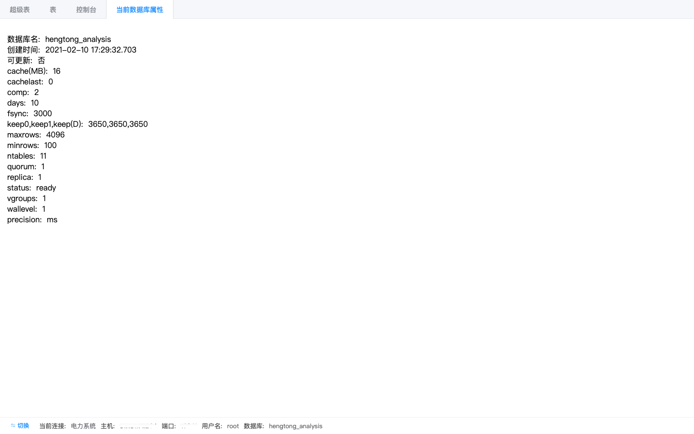

现有bug:
- [x] 数据表控件高度需要根据每页条目数量自动调整，现在每页20条时需要上下滚动。
- [ ] 由于TDengine数据库对大数据集排序操作有限制，数据量大的情况下，时间倒序配置下检索数据会报错。

后期版本待完成功能:
- [ ] 创建超级表（表）功能
- [ ] 修改超级表（表）的表结构
- [ ] 子表与独立表的显示风格区分
- [ ] 完善数据库属性页（修改数据库属性、用户管理等）
- [ ] 超级表标签管理，以及子表的标签配置
- [ ] 按照字段类型检索数据(高级检索功能)
- [ ] 选择数值类型字段进行柱状图，折线图等图表的方式显示数据趋势
- [ ] 显示数据统计量（求和，平均，方差等）
- [ ] 批量插入测试数据功能
- [ ] 数据备份与数据导出功能
- [ ] 修改连接配置信息功能
- [ ] 连接配置信息导出导入功能
- [ ] 基础属性配置功能（连接超时时间、默认每页大小等）
